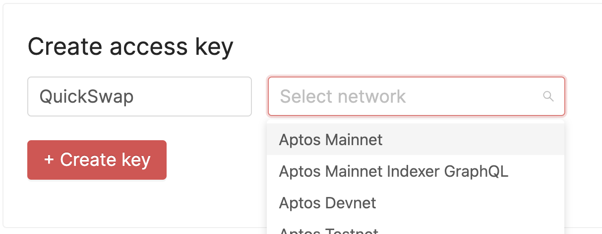
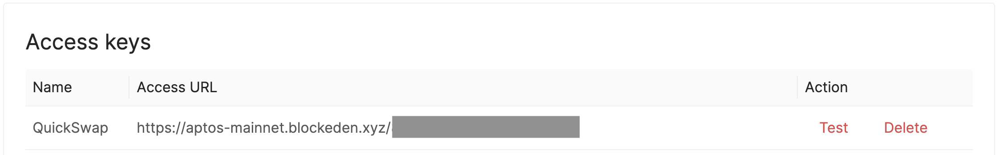

## Overview

BlockEden.xyz is committed to growing with the Aptos and Sui developers and providing the most tailored and scalable developer infrastructure. Thus we have been serving Aptos mainnet since its day-one launch.

In this tutorial, we will share step-by-step tutorials on connecting to Aptos mainnet by using BlockEden.xyz Node Service.

## How to connect to Aptos mainnet?

**Step 1**. Go to https://blockeden.xyz/dash/. Please sign up if you haven't done so.

**Step 2**. Input your name for the API key, select Aptos Mainnet, and then click + Create key.



**Step 3**. Grab your access URL by clicking it and copying it to the clipboard.



**Step 4**. Use the access URL in your project like the following. Remember to replace `42424242424242424242` with your own key.

```typescript
import {AptosClient} from "aptos";

const client = new AptosClient("https://aptos-mainnet.blockeden.xyz/42424242424242424242");
const block = await client.getBlockByHeight(1);
console.log(block);
```


## About BlockEden.xyz

BlockEden.xyz is a San Francisco-based software company that helps web3 developers connect to the Aptos network instantly and securely. Our mission is to build an all-inclusive platform for web3 developers in the next five years, starting with a genesis product that could immediately serve the Aptos developer community's needs. We are committed to making it easy for developers to get started building on blockchain technology, and we believe our platform will play a key role in bringing about mainstream adoption of web3 applications.

## Join Our Community
Join our community to learn more about BlockEden.xyz and stay up to date!
[Discord](https://t.co/ilHSgmYIPT)  |  [Twitter](https://twitter.com/Nodereal_io)
