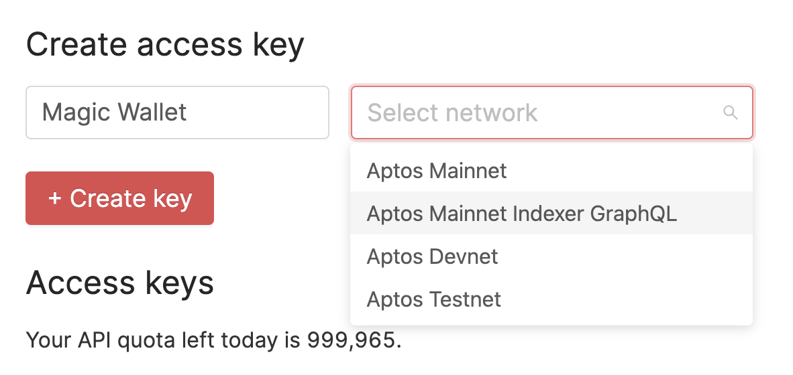
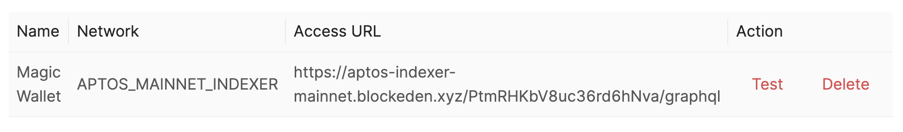
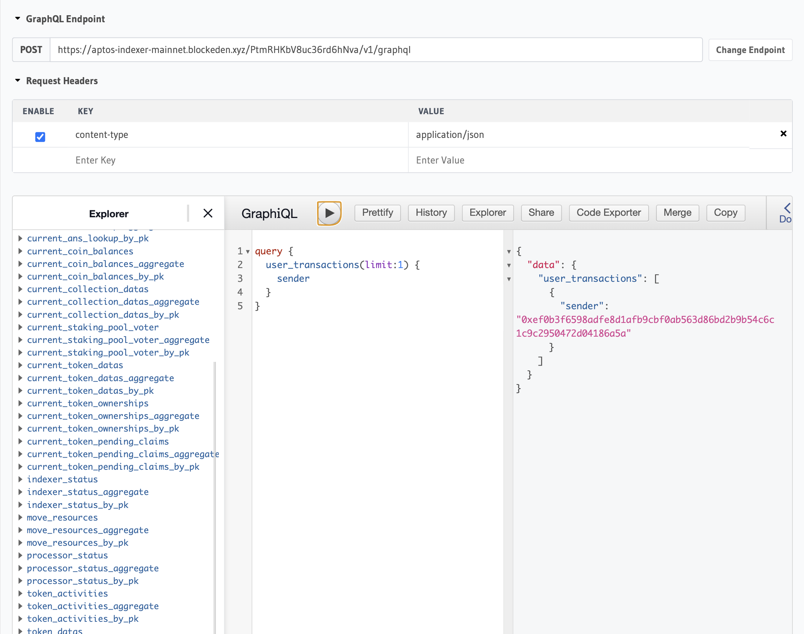

# Aptos GraphQL API now available at BlockEden.xyz

Bock Eden is glad to add the indexer fullnode GraphQL to our Aptos API and Node Service. This solves the pain point immediately for many DApp developers with a high QPS demand in the Aptos ecosystem.

Without our out-of-box performant API, these developers have to connect to the official servers, which are shared across hobbyist developers with a very restrictive rate limit of 300 requests/hour. This limit is not for production-level products. In this case, developers are forced to run the indexer full node by themselves. And unfortunately, the official guide is confusing and does not cover the entire tech stack.

Now, with BlockEden.xyz's Aptos GraphQL API, developers are now free from worrying about the rate limit or the huge hassle of running their own GraphQL servers.

Here's how to get started...

**Step 1**. Go to https://blockeden.xyz/dash/. Please sign up if you haven't done so.

**Step 2**. Input your name for the API key, select *Aptos Mainnet Indexer GraphQL*, and then click *+ Create key*.

**Step 3**. Click the access URL in the table to copy or click *Test* to get started with the Hasura GraphQL playground.

Bungie, who is working on an Aptos wallet, says "This is literally life-saving!"

BlockEden.xyz is committed to growing with the Aptos developers and providing the most tailored and scalable developer infrastructure. This GraphQL feature is exactly the result of listening to our customers. If you are an Aptos developer that needs anything from us, let us know at https://discord.gg/4Yfvs2HWey
