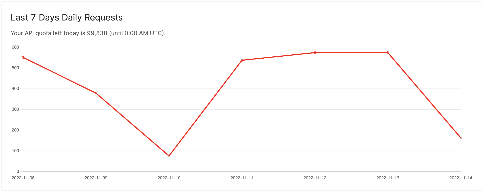

Many of our customers asked us to improve how we measure API consumption. So today, an API usage monitor is added to the dashboard.

The chart above shows a test customer's daily requests in the last seven days. The requests are measured in compute units. A compute unit estimates how many resources an API method consumes on BlockEden.xyz. For example, a simple REST request only consumes 1 CU, while a more complex GraphQL request consumes 5 CUs.

Please note that our daily cutoff for the API meter is UTC 00:00 am.

With this new line chart, you can

- Get more accurate predictions of your API usage.
- Make better decisions about how to use your APIs.
- Spend less time worrying about your usage and more time developing your product.

BlockEden.xyz is committed to making it easy for developers to build applications on the blockchain. Our next step is to add basic data analytics for Aptos and support Sui Devnet. If you have any feedback, talk to us at https://discord.gg/GqzTYQ4YNa.
