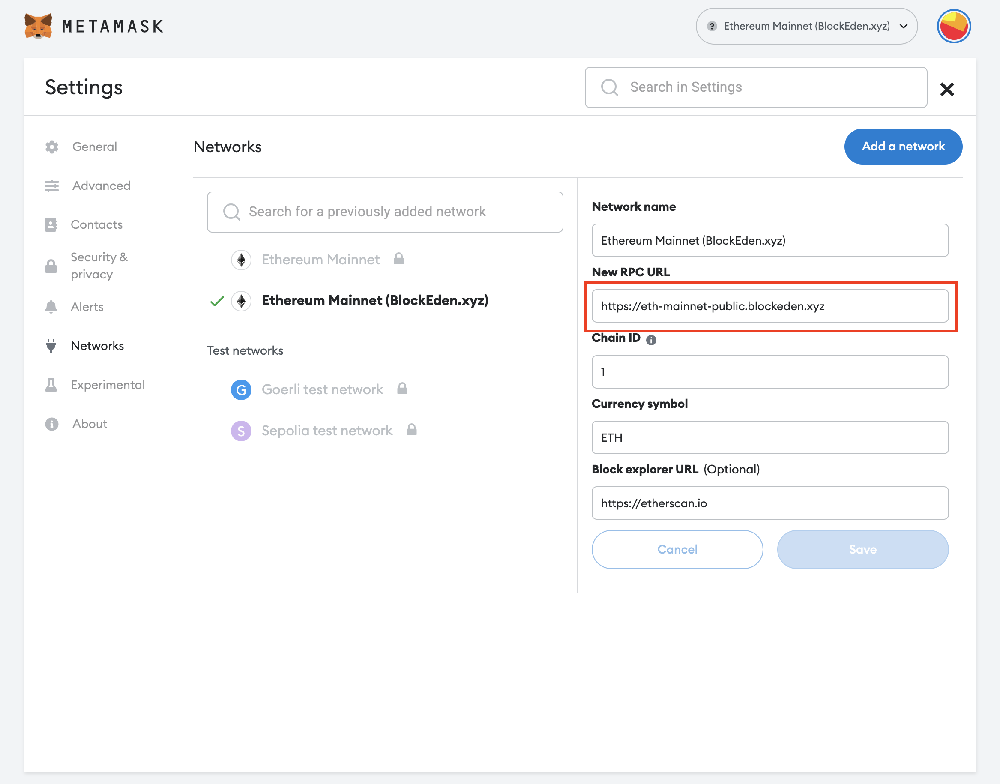

Starting from **Sept 23, 2023**, if you use the default RPC URL (aka https://mainnet.infura.io/v3/) in **Metamask**, your IP address and wallet address will be collected whenever you send a transaction ([source](https://cointelegraph.com/news/metamask-will-start-collecting-user-ip-addresses)).

Some people prefer to keep their identity untracked, and are looking for an alternative RPC URL that doesn’t track user identity. Here **[BlockEden.xyz](https://blockeden.xyz)** gets you covered! We have opened a public Ethereum Mainnet RPC endpoint – **https://eth-mainnet-public.blockeden.xyz for free**, and we **do not** trace any user identity of any transactions going through our RPC URL as well as blockchain data reading operations.

To set it up with your Metamask, go to Settings -> Networks, and click “Add a network” on the upper right corner. You can fill in the following info:
- Network name: **Ethereum Mainnet (BlockEden.xyz)**
- New RPC URL: **https://eth-mainnet-public.blockeden.xyz**
- Chain ID: 1
- Currency symbol: ETH
- Block explorer URL: https://etherscan.io

Then, you’re good to go, and click “Save”. When you want to send an incognito transaction, you could just select “**Ethereum Mainnet (BlockEden.xyz)**” network, and then send the transaction (shhh~).

## What is BlockEden.xyz?

BlockEden.xyz is a suite of APIs powering DApps for Aptos and Sui blockchains of all sizes. Our software and API service enables you to easily access blockchain data so that you can build DApps quickly and efficiently.
If you’re a Web3 developer or DApp owner in need of an RPC connection for Aptos and Sui, look no further than BlockEden.xyz! We are proud to be one of the first infrastructure providers offering this service for this highly anticipated new blockchain. In addition to our RPC connection, we will also offer a variety of other essential services and features for any Web3 project. Learn more about us today and see how we can help you succeed in the blockchain space!

- Twitter: https://twitter.com/BlockEdenHQ
- Discord: https://discord.gg/4Yfvs2HWey

## Will We Help Ethereum Developers Too?
Whether we will offer Ethereum API support to developers is TBD, but your feedback would be important to us. Please let us know your needs!

- Source Link: https://blockeden.xyz/blog/2022/11/25/incognito-ethereum-rpc-url
