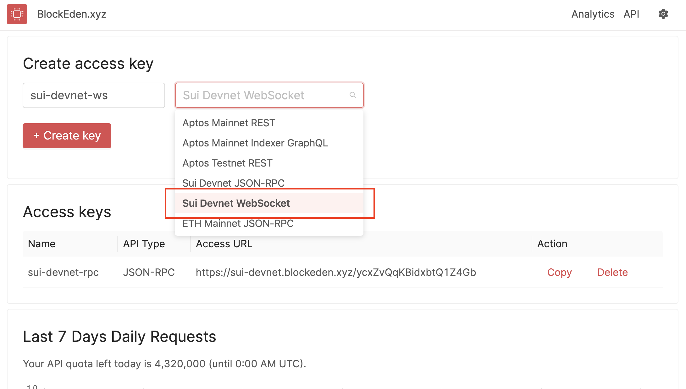

We are among [the first Sui Devnet JSON-RPC providers](https://blockeden.xyz/blog/2022/11/24/blockeden-xyz-becomes-one-of-the-first-sui-devnet-api-providers/).
Now we are excited to expand our API Service to **WebSocket** too. WebSocket
would be useful to those dApps that need to take action on real-time on-chain
events.

## How to get started?

**Step 1.** Go to https://blockeden.xyz/dash/. Please sign up if you haven’t
done so.

**Step 2.** Input your name for the API key, select *Sui Devnet Websocket*, and
then click **+ Create key**.



**Step 3.** Grab your access URL by clicking *Copy* to copy it to the clipboard.

**Step 4.** Use the access URL in your project like the following. Remember to
replace `<access_key>` with your own key.

## How to use WebSocket?

To quickly play around WebSocket endpoint in the command line, you could use
`wscat`. To download it, run the following command:

```
npm install -g wscat
```

Then, run the following command to connect to the WebSocket endpoint (remember
replacing with your own API key):

```
wscat -c wss://sui-devnet.blockeden.xyz/kjz2sTknHkNE9aXQ6j1N
```

Now in the session, you could give the command. For example, you could say
subscribing events that matchin some cerntain criteria:

```
Connected (press CTRL+C to quit)
> {"jsonrpc":"2.0", "id": 1, "method": "sui_subscribeEvent", "params": [{"All":[{"EventType":"MoveEvent"}, {"Package":"0x2"}, {"Module":"devnet_nft"}]}]}
< {"jsonrpc":"2.0","result":6240320950310564,"id":1}
```

And you would also observe events being streamed to your console:

```
< {"jsonrpc":"2.0","method":"sui_subscribeEvent","params":{"subscription":6240320950310564,"result":{"timestamp":1672211297607,"txDigest":"PDPBHEo5pmMeLK8Dc4226MZxUA2dkQK91W2ECHFgN1a","id":{"txSeq":1471806,"eventSeq":2},"event":{"moveEvent":{"packageId":"0x0000000000000000000000000000000000000002","transactionModule":"devnet_nft","sender":"0x35a09652085b5c4c178d9cfe234d8c1a6b89306b","type":"0x2::devnet_nft::MintNFTEvent","fields":{"creator":"0x35a09652085b5c4c178d9cfe234d8c1a6b89306b","name":"Example NFT","object_id":"0x7631724b6eb066b8514c6159f716a8826055ee5e"},"bcs":"djFyS26wZrhRTGFZ9xaogmBV7l41oJZSCFtcTBeNnP4jTYwaa4kwawtFeGFtcGxlIE5GVA=="}}}}}
< {"jsonrpc":"2.0","method":"sui_subscribeEvent","params":{"subscription":6240320950310564,"result":{"timestamp":1672211297614,"txDigest":"XcTtaU28vUsR18ZMRhE7XuMadeUfCj8kTZfHD1Xs8H7","id":{"txSeq":1471807,"eventSeq":2},"event":{"moveEvent":{"packageId":"0x0000000000000000000000000000000000000002","transactionModule":"devnet_nft","sender":"0xc9a7020d260599e06b63baae7504b2ead68a580a","type":"0x2::devnet_nft::MintNFTEvent","fields":{"creator":"0xc9a7020d260599e06b63baae7504b2ead68a580a","name":"Example NFT","object_id":"0xdc2961ac31f550fcae6ac050c4cc5c364f3736c3"},"bcs":"3ClhrDH1UPyuasBQxMxcNk83NsPJpwINJgWZ4Gtjuq51BLLq1opYCgtFeGFtcGxlIE5GVA=="}}}}}
< {"jsonrpc":"2.0","method":"sui_subscribeEvent","params":{"subscription":6240320950310564,"result":{"timestamp":1672211297617,"txDigest":"ZpnGea1XkkzfsBeSCnR37xKvkdCSgjcfp81owD6QS4i","id":{"txSeq":1471808,"eventSeq":2},"event":{"moveEvent":{"packageId":"0x0000000000000000000000000000000000000002","transactionModule":"devnet_nft","sender":"0x96e31283ad37fe2ebbdff635501c9feaa2bd8af7","type":"0x2::devnet_nft::MintNFTEvent","fields":{"creator":"0x96e31283ad37fe2ebbdff635501c9feaa2bd8af7","name":"Wizard Land","object_id":"0xe63f7ee979d23d4ab60b598529dc4136d33f07a8"},"bcs":"5j9+6XnSPUq2C1mFKdxBNtM/B6iW4xKDrTf+Lrvf9jVQHJ/qor2K9wtXaXphcmQgTGFuZA=="}}}}}
...
```

For more details of subscribing Sui events via WebSocket, please refer to the [offical
doc](https://docs.sui.io/build/event_api#subscribe-to-sui-events).

# Misc

To prevent to too many outstanding idle connections, we will drop any WebSocket
connection that hasn't exchanged data in the past **5 minutes**. Client will receive an
error code: 1006.
