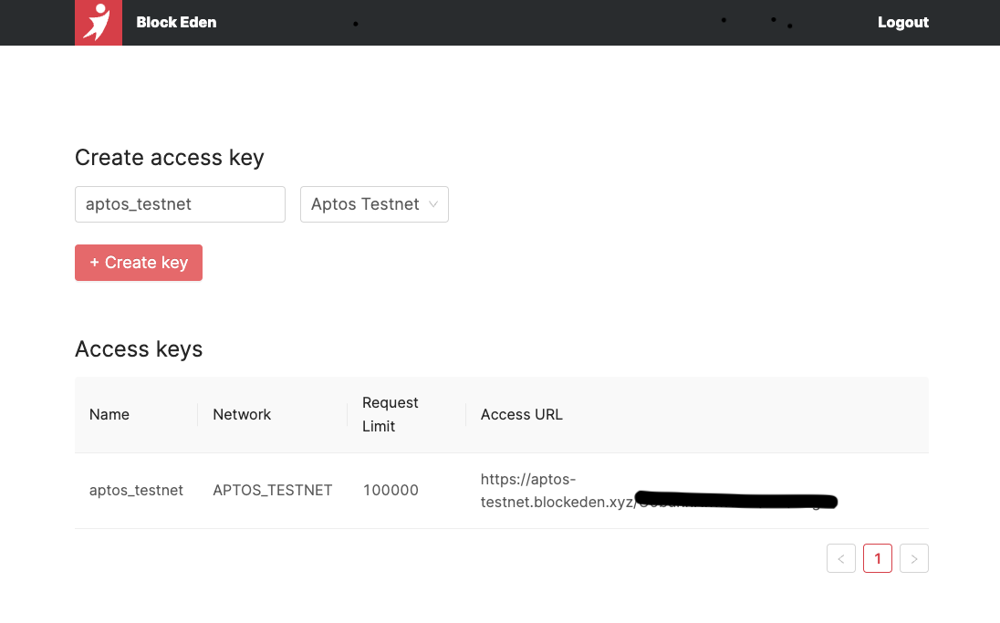

# Aptos API Service

Block Eden provides [Aptos](https://aptoslabs.com/) node API.

* **Standard Interface**: supporting Aptos Node API via Restful API with HTTPS.
* **Reliability**: running on the latest network upgrades with a minimum 99.9%
  uptime guarantee.
* **Instant Availability**: connecting your application with one line of code. No
  syncing, and no complicated setups.
* **Full Delegation**: freeing you from dealing with DevOps work for Aptos node.


## Sign Up

If you don't have an account yet, please [create a Block Eden account](https://blockeden.xyz/dash/sign-up/) first.

## Create a Block Eden access key

You'll need access keys to call our APIs. Here is how to get them.

1. Go to https://blockeden.xyz/dash/
2. Enter the name of the access key you want to create.
3. Select a network. We support the following networks...
   1. **Aptos Mainnet** for the primary public Aptos production blockchain, where actual-value transactions occur on the distributed ledger.
   1. **Aptos Testnet** for testing and rewarding contributors and nodes, where transactions have no real value.
   2. **Aptos Devnet** for experimenting with new ideas, where transactions have no real value.




## Make a request with Block Eden

The access URL is your unique endpoint to use Aptos node API. Copy it and
compose the first request: e.g., `https://aptos-testnet.blockeden.xyz/<access_key>/v1`

```
{
  "chain_id": 2,
  "epoch": "823",
  "ledger_version": "282458715",
  "oldest_ledger_version": "132658733",
  "ledger_timestamp": "1665901262718511",
  "node_role": "full_node",
  "oldest_block_height": "15427523",
  "block_height": "21026963",
  "git_hash": "36162a71289270c41371874fa2e818da96bc4751"
}
```

If you see a response like the above, you're all set.

## API Reference

Please refer to the official
[API docs](https://fullnode.devnet.aptoslabs.com/v1/spec#/).

## Starting to Build!

If there’s anything else you need, join us on
[Discord](https://discord.gg/GqzTYQ4YNa)!
