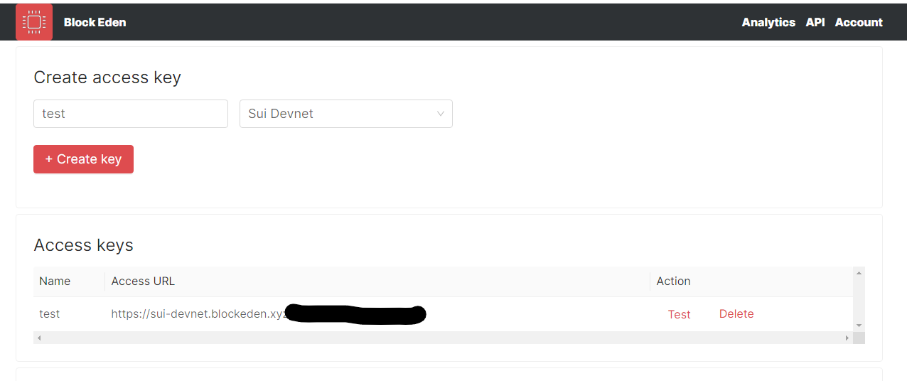

# Get started

BlockEden.xyz provides [Sui](https://sui.io/) JSON-RPC API.

* **Standard Interface**: supporting Sui JSON-RPC API with HTTPS.
* **Reliability**: running on the latest network upgrades with a minimum 99.9%
  uptime guarantee.
* **Instant Availability**: connecting your application with one line of code. No
  syncing, and no complicated setups.
* **Full Delegation**: freeing yourself from the DevOps work for maintaining Sui node.


## Create a BlockEden.xyz access key

**Step 1**. Go to https://blockeden.xyz/dash/. Please sign up if you haven't done so.
**Step 2**. Input your name for the API key, select Sui Devnet, and then click *+ Create key*.



**Step 3**. Grab your access URL by clicking it and copying it to the clipboard.
**Step 4**. Use the access URL in your project like the following. Remember to replace `<access_key>` with your own key.

Using `CURL` to connect Sui

```
# sui json-rpc discover request

curl -X POST https://sui-devnet.blockeden.xyz/<access_key> \
-H 'Content-Type: application/json' \
-d '{ "jsonrpc":"2.0", "method":"rpc.discover","id":1}'
```

Using TypeScript SDK to connect Sui

```typescript
const { JsonRpcProvider } = require("@mysten/sui.js");

(async () => {
  const providerUrl = "https://sui-devnet.blockeden.xyz/<access_key>"
  const provider = new JsonRpcProvider(providerUrl);
  const totalTxNumber = await provider.getTotalTransactionNumber(
  );
  console.log(`${providerUrl} getTotalTransactionNumber: ` + totalTxNumber);
})()
```

## API Reference

Please refer to the official
[API docs](https://docs.sui.io/sui-jsonrpc).

## Starting to Build!

If there’s anything else you need, join us on
[Discord](https://discord.gg/GqzTYQ4YNa)!
